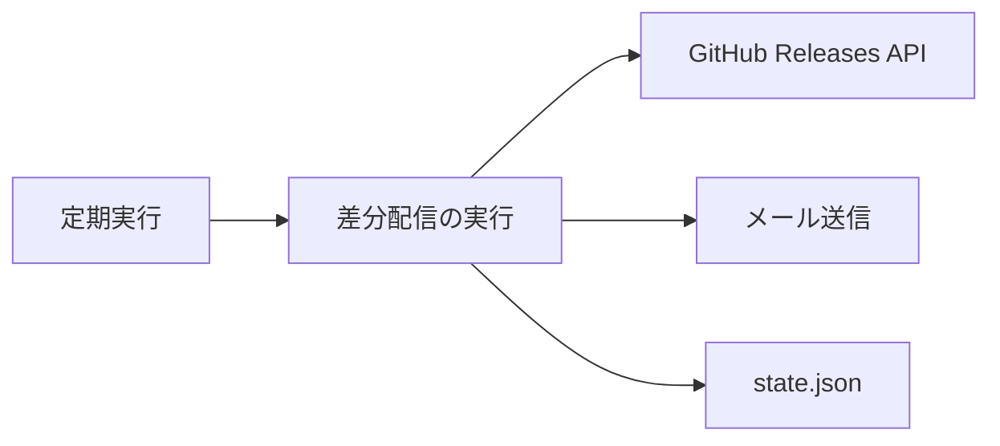
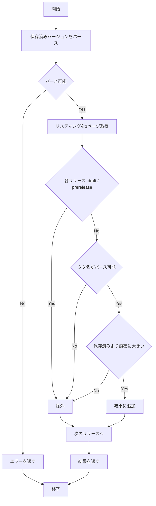

# release-since-semver - 要件定義書

## 1. 概要

### 1.1 背景

差分配信は、状態ファイルに保存したバージョンを起点に「まだ配信していないリリース」を決める。保存済みバージョンをリスティング中から探す同一性一致で起点を決める場合、そのバージョンが upstream のリスティングから消えると起点を失う。また、1 回の実行が扱うリリース件数に上限が無いと、翻訳とメールのペイロードが無界になる。

起点の決め方を semver 比較に変えると、状態ファイルへ書き戻す値の決め方と、その値が常にパース可能であることの担保が、あわせて問題になる。リスティング順の先頭を書き戻すと配信済みのバージョンが再配信され、パース不能なタグを起点として書き戻すと次回実行がエラーになる。

加えて、旧 `feature-docs/release-notes-fetcher/` には現行仕様と一致しない記述が残っている。

### 1.2 目的

- 保存済みバージョンが upstream から削除されていても差分配信が破綻せず、本当に新しいリリースだけが届く状態にする
- 1 回の実行が扱うリリース件数に上限を設け、翻訳・メールのペイロードを有界に保つ
- 旧 `feature-docs/release-notes-fetcher/` の記述を現行仕様に一致させ、docs と実装の乖離をなくす
- 配信済みのバージョンの再配信が起きない状態にする
- 状態ファイルへ書かれる値が常に FR2 のパース規則を満たすことを、書き込み側で担保する
- `vMAJOR.MINOR.PATCH` の比較規則の定義箇所を `internal/github` の 1 箇所に保つ

### 1.3 スコープ

**対象**

- `internal/github` の `(*Client).Since(version string) ([]Release, error)` の「新しい」判定と取得範囲
- `internal/github` の `Latest` の選択規則（FR10）
- セマンティックバージョンのパースと比較を行う非公開ヘルパ、およびそれを覆うエクスポートされた入口（NFR4）
- `internal/app` が状態ファイルへ書き戻す値の決定（FR9）
- `internal/app` の `ReleaseFetcher.Since` の doc コメント
- 旧 `feature-docs/release-notes-fetcher/` の記述更新（16 箇所）
- FR9 / FR10 によって新たに陳腐化する旧 `feature-docs/release-notes-fetcher/` の記述更新（FR11）

**対象外**

- `Latest` のページング歩行（現在もページングを行う。したがって `tasks/task0003.md` の Files to Create にある "pagination" の記述は陳腐化しておらず、更新対象に含めない）。`Latest` の選択規則は FR10 として対象に含める
- 状態ファイルの保存タイミング（送信成功後にのみ保存する既存の契約は変更しない。保存する値の決め方だけが FR9 で変わる）
- メール HTML ビルダ（`internal/mail`）および `design-system/tokens.yaml` の消費先

## 2. ビジネス要件

### 2.1 ビジネス目標

| ID | 目標 |
|----|------|
| BO1 | 保存済みバージョンが upstream から削除されていても差分配信が破綻せず、本当に新しいリリースだけが届く状態にする |
| BO2 | 1 回の実行が扱うリリース件数に上限を設け、翻訳・メールのペイロードを有界に保つ |
| BO3 | 旧 `feature-docs/release-notes-fetcher/` の記述を現行仕様に一致させ、docs と実装の乖離をなくす |
| BO4 | 配信済みのバージョンの再配信が起きない状態にする |
| BO5 | 状態ファイルへ書かれる値が常に FR2 のパース規則を満たすことを、書き込み側で担保する |
| BO6 | `vMAJOR.MINOR.PATCH` の比較規則の定義箇所を `internal/github` の 1 箇所に保つ |

### 2.2 対象ユーザー

| ユーザータイプ | 説明 |
|----------------|------|
| リリースノートの受信者 | 差分配信されたリリースノートをメールで受け取る |
| リポジトリの保守者 | 実装とドキュメントの整合を保つ |

### 2.3 期待される効果

- 保存済みバージョンがリスティングから消えても、全件配信に落ちることなく差分だけが届く
- 保存済みバージョンがどれだけ古くても、1 実行が扱うリリースは最大 10 件に収まる
- 旧ドキュメントを読んだときに、ページング前提・同一性一致前提の誤った理解が生じない
- 一度配信されたリリースが次回実行で再び配信されない
- 状態ファイルに書かれる値が常にパース可能であり、人手の修正を要する状態をツール自身が作らない

## 3. ユースケース

### 3.1 ユースケース一覧

| ID | ユースケース名 | アクター | 優先度 |
|----|----------------|----------|--------|
| UC01 | 差分配信の実行 | 定期実行 | 高 |
| UC02 | 旧ドキュメントの記述更新 | リポジトリの保守者 | 高 |

### 3.2 ユースケース詳細

#### UC01: 差分配信の実行

**アクター**: 定期実行

**事前条件**:
- 設定が読み込める
- 状態ファイル `$XDG_STATE_HOME/claude-release-notes/state.json` に `last_version` が保存されている

**基本フロー**:
1. 設定を読み込む
2. 状態ファイルから保存済みバージョンを読み込む
3. GitHub のリリースリスティングを先頭 1 ページ（`per_page=10`, `page=1`）だけ取得する
4. 各リリースのタグ名をセマンティックバージョンとしてパースし、保存済みバージョンより厳密に大きいものだけを抽出する
5. 抽出したリリースを翻訳する
6. メールを送信する
7. 送信に成功した場合にのみ、状態ファイルを更新する。書き戻す `last_version` は、その実行で配信したリリースのうちセマンティックバージョン上で最大のタグ名とする（FR9）

**代替フロー**:
- 保存済みバージョンがリスティング先頭と同一の場合、抽出結果は空スライスとなり、エラーにはしない
- リスティング中にパース不能なタグがある場合、そのリリースを読み飛ばして処理を継続する
- 保存済みバージョンがパース不能な場合、比較の基準が無いためエラーを返し、全件配信へフォールバックしない
- GitHub API が非 2xx を返した場合、HTTP ステータスを含むエラーを返す

**事後条件**:
- 送信に成功した場合、状態ファイルの `last_version` が、その実行で配信したリリースのうち semver 最大のタグ名に更新されている
- エラーで終了した場合、状態ファイルは更新されていない

**ユースケース図**:


#### UC02: 旧ドキュメントの記述更新

**アクター**: リポジトリの保守者

**事前条件**:
- 旧 `feature-docs/release-notes-fetcher/` に現行仕様と一致しない記述が残っている

**基本フロー**:
1. 特定済みの 16 箇所を現行仕様に書き換える
2. ページング前提・同一性一致前提・`FetchNewer`・`per_page=30` の記述が残っていないことを確認する
3. FR9 / FR10 によって新たに陳腐化した箇所（FR11）を現行仕様に書き換える
4. 「保存値＝リスティング先頭」前提と「`Latest` は無条件に先頭を選ぶ」前提の記述が残っていないことを確認する

**代替フロー**:
- `Latest` に関するページングの記述は現行仕様と一致するため、書き換えない

**事後条件**:
- 旧ドキュメントの記述が現行仕様と一致している

## 4. 機能要件

### 4.1 機能一覧

| ID | 機能名 | 説明 | 優先度 |
|----|--------|------|--------|
| FR1 | セマンティックバージョン比較による「新しい」判定 | タグ名の semver 比較で「新しい」を判定する | 高 |
| FR2 | タグ名のパース仕様 | `vMAJOR.MINOR.PATCH` のみをパース対象とする | 高 |
| FR3 | パース不能なタグはスキップ | リスティング中のパース不能なタグを読み飛ばす | 高 |
| FR4 | パース不能な保存済みバージョンはエラー | 比較の基準が無い場合はエラーを返す | 高 |
| FR5 | 1 ページのみ読む有界化 | 先頭 1 ページのみを取得しページングを歩かない | 高 |
| FR6 | draft / prerelease の除外と並び順 | draft・prerelease を除外し、リスティング順を保つ | 高 |
| FR7 | 呼び出し側 doc コメントの整合 | `internal/app` の doc コメントを現行仕様に合わせる | 中 |
| FR8 | 旧 `feature-docs/release-notes-fetcher/` の記述更新 | 特定済み 16 箇所を現行仕様に書き換える | 高 |
| FR9 | 保存するベースラインは配信分の semver 最大 | 書き戻す `last_version` を配信分の semver 最大とする | 高 |
| FR10 | 最新リリース選択でのパース不能タグの除外 | `Latest` がパース不能なタグのリリースを選ばない | 高 |
| FR11 | FR9 / FR10 で陳腐化する旧 `feature-docs` の記述更新 | FR8 の 16 箇所とは別集合の記述を書き換える | 高 |

### 4.2 機能詳細

#### FR1: セマンティックバージョン比較による「新しい」判定

**説明**: `Since(version)` は、保存済みバージョンをリスティング中から探す同一性一致ではなく、タグ名のセマンティックバージョン比較で「新しい」を判定する。major → minor → patch の順に比較し、厳密に大きいものだけを新しいとみなす。保存済みバージョンと等しいものは含めない。

**入力**:
- `version`: string - 状態ファイルの保存済みバージョン（例 `v2.1.243`）

**出力**:
- `[]Release`: リリースの配列 - 保存済みバージョンより semver 上で新しいリリース

**処理フロー**:


**ビジネスルール**:
- 比較は major → minor → patch の優先順位で行う
- 保存済みバージョンと等しいバージョンは結果に含めない
- 保存済みバージョンがリスティングに存在しないことは正常系であり、全件を返さない

**エラーケース**:
| エラー | 条件 | 対応 |
|--------|------|------|
| 比較基準なし | 保存済みバージョンがパース不能 | エラーを返す（FR4） |

#### FR2: タグ名のパース仕様

**説明**: パース対象は `vMAJOR.MINOR.PATCH`。先頭の `v` は任意。ドット区切りでちょうど 3 要素、各要素は符号なし十進整数のみ。プレリリース／ビルドサフィックス付き（例 `v2.5.0-rc1`）と要素数違い（`v2.9` / `v2.1.2.3`）はパース不能とする。

**入力**:
- `tag`: string - リリースのタグ名

**出力**:
- `version`: 構造体 - major / minor / patch
- `ok`: bool - パースの成否

**バリデーション**:
| 項目 | ルール | エラーメッセージ |
|------|--------|------------------|
| 先頭の `v` | 任意（あってもなくてもよい） | - |
| 要素数 | ドット区切りでちょうど 3 | - |
| 各要素 | 符号なし十進整数のみ | - |
| サフィックス | プレリリース／ビルドサフィックスは不可 | - |

**エラーケース**:
| エラー | 条件 | 対応 |
|--------|------|------|
| パース不能 | 上記バリデーションのいずれかに反する | `ok = false` を返す（呼び出し側が FR3 / FR4 で扱う） |

#### FR3: パース不能なタグはスキップ

**説明**: リスティング中のパース不能なタグ（例 `nightly`, `v2.9`, `v2.5.0-rc1`）は「新しくない」として読み飛ばし、実行を中断しない。

**入力**:
- リスティング中の各リリースのタグ名

**出力**:
- 該当リリースを含まない結果

**ビジネスルール**:
- 読み飛ばしはエラーにしない
- 他のリリースの取得は継続する

#### FR4: パース不能な保存済みバージョンはエラー

**説明**: 状態ファイルの保存済みバージョンがパース不能な場合、比較の基準が無いため `Since` はエラーを返す。エラーメッセージは問題の値を名指しする。全件配信へのフォールバックはしない。この読み出し側の契約に対応する書き込み側の担保は FR10 にあり、状態ファイルへ書かれる値は常に FR2 のパース規則を満たす。

**入力**:
- `version`: string - 状態ファイルの保存済みバージョン

**出力**:
- `error`: 問題の値を含むエラー

**エラーケース**:
| エラー | 条件 | 対応 |
|--------|------|------|
| 保存済みバージョンがパース不能 | `parseVersion` が失敗 | 問題の値を含むエラーを返し、処理を中断する |

#### FR5: 1 ページのみ読む有界化

**説明**: `Since` は先頭 1 ページ（`per_page=10`）のみを取得し、ページングを歩かない。保存済みバージョンがどれだけ古くても、1 実行が返すリリース数は最大 10 件に収まる。2 ページ目以降にある新しいリリースは取り残されるが、これは有界性を優先した恒久的な設計判断として受容する。

**入力**:
- なし（リクエストパラメータは固定）

**出力**:
- 最大 10 件のリリース

**ビジネスルール**:
- リクエストされるページは `page=1` のみ
- `per_page` はコード上の上限値と一致する

#### FR6: draft / prerelease の除外と並び順

**説明**: draft・prerelease は `Since` / `Latest` のいずれの結果にも含めない。`Latest` はこれに加えてパース不能なタグのリリースも選択対象から外す（FR10）。結果はリスティング順（新しい順）を保つ。該当が 0 件のときは空スライスを返し、エラーにはしない。

**出力**:
- `[]Release`: リスティング順（新しい順）。該当 0 件のときは空スライス

**ビジネスルール**:
- draft は除外する
- prerelease は除外する
- `Latest` ではパース不能なタグのリリースも除外する（FR10）
- 並び順はリスティング順を保つ
- 0 件は正常系

#### FR7: 呼び出し側 doc コメントの整合

**説明**: `internal/app` の `ReleaseFetcher.Since` の doc コメントが、semver 比較・1 ページ有界・空スライス＝最新である旨を正しく述べている状態にする。

#### FR8: 旧 `feature-docs/release-notes-fetcher/` の記述更新

**説明**: reference_impact が特定した 16 箇所を現行仕様に書き換える。

**対象**:

| ファイル | 箇所 |
|----------|------|
| `feature-docs/release-notes-fetcher/SPEC.md` | US1 受け入れ基準（paging as needed）、FR1、Data Flow（FetchNewer）、API Design（per_page）、TS-1、Edge Cases |
| `feature-docs/release-notes-fetcher/REQUIREMENTS.md` | UC01 基本フロー、F01、8.2、10.1 リスク対応策、11.1 |
| `feature-docs/release-notes-fetcher/tasks/task0003.md` | Design 5、AC-1、AC-4、Test Notes |
| `feature-docs/release-notes-fetcher/IMPLEMENTATION.md` | Shared Components の差分取得の行 |

**ビジネスルール**:
- `Latest` は現在もページングを行うため、`tasks/task0003.md` の Files to Create にある "pagination" の記述は陳腐化しておらず、対象外とする

#### FR9: 保存するベースラインは配信分の semver 最大

**説明**: メール送信成功後に状態ファイルへ書き戻す `last_version` は、その実行で配信したリリースのうちセマンティックバージョン上で最大のタグ名とする。結果配列の先頭（リスティング順の先頭）ではない。配信 0 件のときは保存しない（既存の契約のまま）。`internal/app` はこの「semver 最大」の判定を自前で行わず、NFR4 が定める `internal/github` のエクスポートされた入口を呼んで決める。

**入力**:
- その実行で配信したリリースの集合

**出力**:
- `last_version`: string - 配信分のうち semver 上で最大のタグ名

**ビジネスルール**:
- 保存値はリスティング順の先頭ではなく semver 最大とする
- 配信 0 件のときは状態ファイルを更新しない
- 保存タイミング（送信成功後）は変更しない
- semver 最大の判定は `internal/github` のエクスポートされた入口に委ねる（NFR4）

#### FR10: 最新リリース選択でのパース不能タグの除外

**説明**: `Latest` は draft / prerelease に加えて、`vMAJOR.MINOR.PATCH` としてパースできないタグ名のリリースも選択対象から外す。これは差分経路が FR3 で既に行っているのと同じ規則である。パース可能な配信対象が 1 件も無いリスティングは、既存の "no releases found" エラーに落ちる。結果として初回実行が状態ファイルに書く値は常に FR2 のパース規則を満たし、FR4 のエラー状態を人手の修正なしに作らない。

**入力**:
- リリースリスティング

**出力**:
- パース可能かつ非 draft・非 prerelease のリリースのうち、リスティング順で最初のもの

**エラーケース**:
| エラー | 条件 | 対応 |
|--------|------|------|
| 配信対象なし | パース可能かつ非 draft・非 prerelease のリリースが 1 件も無い | 既存の "no releases found" エラーを返す |

#### FR11: FR9 / FR10 で陳腐化する旧 `feature-docs` の記述更新

**説明**: FR9 / FR10 によって現行挙動と食い違うようになった旧 `feature-docs/release-notes-fetcher/` の記述を更新する。既決方針（陳腐化した箇所のみを現行仕様に更新する）に従う。対象は FR8 の 16 箇所とは重複しない別集合であり、reference_impact の走査結果に基づいて特定する。

**対象となる記述の型**:
- 保存値がリスティング順の先頭であることを前提とした記述
- `Latest` が無条件にリスティング先頭を選ぶことを前提とした記述

**ビジネスルール**:
- FR8 の 16 箇所は task0001 で完了済みであり、再度の書き換え対象にはしない

## 5. 非機能要件

### 5.1 パフォーマンス要件

- **NFR2 - GitHub API リクエストの有界性**: `Since` 経路の 1 実行あたりの GitHub API リクエストは 1 回に固定する。FR10 は `Latest` のページング歩行を変えないため、`Latest` が NFR2 の対象外である点も変わらない
- 1 実行が扱うリリース件数: 最大 10 件

### 5.2 セキュリティ要件

- **NFR3 - 秘匿情報を漏らさないエラー**: 非 2xx 応答のエラーは HTTP ステータスを含み、トークン値を含めない
- 認証: `Authorization: Bearer {token}` ヘッダ

### 5.3 可用性要件

本要件では稼働率・障害復旧時間の目標値を定義しない。状態ファイル破損時の復旧手順は 10.1 に記載する。

### 5.4 保守性要件

- **NFR1 - 依存を増やさない**: semver 比較は Go 標準ライブラリのみで自前実装する。外部 semver ライブラリを追加しない（`go.mod` の require は `gopkg.in/yaml.v3` のみを維持）
- **NFR4 - semver 比較規則の定義箇所を 1 つに保つ**: `vMAJOR.MINOR.PATCH` のパースと比較の規則は `internal/github` にのみ存在する。`internal/github` は「リリースの集合を受け取り、その中で semver 最大のものを返す」エクスポートされた入口を新設し、`internal/app`（FR9）はそれを呼ぶ。`version` / `parseVersion` / `isNewer` はその入口の背後で unexported のまま据え置く。`internal/app` 側でタグ名を再パースしたり比較規則を書き直したりしない
- ドキュメント: `internal/app` の doc コメント（FR7）と旧 `feature-docs/release-notes-fetcher/`（FR8 / FR11）を現行仕様と一致させる

### 5.5 互換性要件

- GitHub Releases API: `Accept: application/vnd.github+json`

## 6. UI/UX要件

画面を持たないため該当なし。

## 7. データ要件

### 7.1 データモデル概要

状態ファイル `$XDG_STATE_HOME/claude-release-notes/state.json` は、配信済みバージョンの基準を 1 件だけ保持する。

```json
{"last_version": "v2.1.243"}
```

### 7.2 データ項目

| エンティティ | 項目名 | 型 | 必須 | 説明 |
|--------------|--------|-----|------|------|
| state.json | last_version | string | ○ | 直近の実行で配信したリリースのうち、セマンティックバージョン上で最大のタグ名（FR9）。`vMAJOR.MINOR.PATCH` 形式であること |

### 7.3 データ保持期間

| データ種別 | 保持期間 |
|------------|----------|
| state.json の last_version | 最新 1 件のみを保持し、メール送信に成功するたびに上書きする |

## 8. 外部連携

### 8.1 連携システム

| システム名 | 連携方法 | データ |
|------------|----------|--------|
| GitHub Releases API | HTTPS GET | `anthropics/claude-code` のリリースリスティング |

### 8.2 API仕様要件

```
GET https://api.github.com/repos/anthropics/claude-code/releases?per_page=10&page=1
Authorization: Bearer {token}
Accept: application/vnd.github+json
```

- `Since` はこのリクエストを 1 回だけ行い、ページングを歩かない
- `Latest` は現在もページングを歩く（本要件では変更しない）。選択規則のみ FR10 で変わる

## 9. 制約条件

### 9.1 技術的制約

- semver 比較は Go 標準ライブラリ（`strconv` / `strings`）のみで自前実装する
- 外部 semver ライブラリを追加しない（`go.mod` の require は `gopkg.in/yaml.v3` のみ）
- `Since` 経路の GitHub API リクエストは 1 実行あたり 1 回
- semver のパース・比較規則の定義箇所は `internal/github` の 1 箇所のみとする（NFR4）

### 9.2 ビジネス上の制約

- 2 ページ目以降にある新しいリリースの取り残しは、有界性を優先した恒久的な受容とする

### 9.3 スケジュール制約

なし。

### 9.4 宣言された変更集合

このフィーチャー固有のパスは手動で列挙せず、create-plan で `workflow.yaml` の各タスクの `files` から導出する（`references/phases/create-plan-phase.md`）。

**デフォルトメンバー**（SPEC作成者が明示的に除外しない限り、常に宣言に含まれる）:
- `feature-docs/release-since-semver/**`
- `test-docs/release-since-semver/**`

`feature-docs/release-since-semver/**` に含まれるもの: `REQUIREMENTS.md`、`SPEC.md`、`IMPLEMENTATION.md`、`workflow.yaml`、`phase-state/`、`tasks/`、`reviews/roundN.yaml`、`VERIFICATION.md`、`retrospect.yaml`、およびデザインステップが生成するデザイン成果物。生成主体は各フェーズドキュメントおよび `references/phase-state.md` を参照。

`test-docs/release-since-semver/**` に含まれるもの: `test-docs/release-since-semver/{T}.tests.yaml`。生成主体は `implement-phase.md` を参照。

**意味論**:
- デフォルトのメンバーは、SPEC作成者が明示的に除外しない限り宣言に含まれる。
- この宣言はスーパーセットの主張であり、実際の変更集合は宣言に含まれる（CONTAINED IN）必要がある。

## 10. 想定される課題とリスク

### 10.1 技術的課題

| 課題 | 影響度 | 対応策 |
|------|--------|--------|
| 2 ページ目以降にある新しいリリースが取り残される | 中 | 有界性を優先した恒久的な設計判断として受容する（後続要件も Open Question も作らない） |
| `state.json` の `last_version` がパース不能になると `Since` がエラーになる | 中 | FR10 により、このツール自身が書き込む値は常にパース可能である。外部要因で壊れた場合の復旧は自動化せず手順を文書化する。(1) `state.json` の `last_version` を有効な `vMAJOR.MINOR.PATCH` に手で書き換える、(2) `state.json` を削除して初回実行扱いに戻す（パース可能な最新 1 件のみ配信される） |
| 整形コマンドが供給された入力（`go.mod` / `go.sum` / `test/README.md`）に根拠が無い | 低 | 本要件では整形コマンドを規定しない |

### 10.2 ビジネスリスク

| リスク | 発生確率 | 影響度 | 対応策 |
|--------|----------|--------|--------|
| 1 実行あたり 10 件を超えるリリースがあった場合に配信漏れが起きる | 低 | 中 | 恒久受容とする（9.2） |
| 配信済みのバージョンが次回実行で再配信される | 中 | 中 | FR9 で保存値を配信分の semver 最大とし、AC-10 / TS-13 で確認する |
| 旧ドキュメントの記述が現行仕様と乖離したまま残る | 中 | 中 | FR8 で 16 箇所を、FR11 で FR9 / FR10 が新たに陳腐化させた箇所を書き換え、AC-9 / TS-9 および AC-12 / TS-15 で確認する |

## 11. 成功基準

### 11.1 受け入れ基準

- [ ] AC-1: 保存済みバージョンより semver 上で新しいリリースだけが、新しい順で返る
- [ ] AC-2: draft / prerelease は `Since` / `Latest` のどちらの結果にも現れない
- [ ] AC-3: 保存済みバージョンがリスティング先頭と同一のとき、空スライスが返る
- [ ] AC-4: 保存済みバージョンがリスティングから削除されていても正常系として扱われ、比較で上位のものだけが返る（全件は返らない）
- [ ] AC-5: パース不能なタグは読み飛ばされ、他のリリースの取得は継続する
- [ ] AC-6: 保存済みバージョンがどれだけ古くても、リクエストされるページは `page=1` のみで、`per_page` はコード上の上限値と一致する
- [ ] AC-7: パース不能な保存済みバージョンではエラーになり、エラー文字列が問題の値を含む
- [ ] AC-8: 非 2xx 応答のエラーがステータスを含み、トークン値を含まない
- [ ] AC-9: 旧 `feature-docs/release-notes-fetcher/` の 16 箇所が現行仕様に更新され、ページング前提・同一性一致前提・`FetchNewer`・`per_page=30` の記述が残っていない
- [ ] AC-10 (FR9): リスティング `[v2.1.244, v2.2.0]`・保存済み `v2.0.0` のように結果の先頭が semver 最大でない場合でも、保存される `last_version` は `v2.2.0` となり、次回実行で `v2.2.0` が再配信されない
- [ ] AC-11 (FR10): 非 draft・非 prerelease だがタグがパース不能なリリースがリスティング先頭にあっても `Latest` はそれを返さず、次のパース可能なリリースを返す。パース可能な配信対象が無ければ "no releases found" エラーになる
- [ ] AC-12 (FR11): 旧 `feature-docs` の該当箇所が FR9 / FR10 後の挙動と一致している
- [ ] AC-13 (NFR4): `internal/app` に `vMAJOR.MINOR.PATCH` のパース・比較コードが存在せず、semver 最大の選択は `internal/github` のエクスポートされた入口の呼び出し 1 箇所で行われている。`version` / `parseVersion` / `isNewer` は引き続き unexported

### 11.2 KPI

| 指標 | 目標値 | 測定方法 |
|------|--------|----------|
| `Since` 経路の GitHub API リクエスト数 | 1 実行あたり 1 回 | TS-4 でリクエストされたページを検証 |
| 1 実行が返すリリース件数 | 最大 10 件 | `per_page` の上限値で担保 |
| 外部依存の追加数 | 0（`go.mod` の require は `gopkg.in/yaml.v3` のみ） | `go.mod` の確認 |
| semver 比較規則の定義箇所 | 1（`internal/github`） | TS-16 で確認 |

## 12. テストシナリオ

### 12.1 テスト観点

- [ ] 正常系: TS-1（FR1/AC-1）モックリスティングに対し、semver 上で新しい分だけが新しい順で返る
- [ ] 正常系: TS-2（FR1/AC-3）保存済みバージョンが最新のとき空スライスが返る
- [ ] 正常系: TS-3（FR1/AC-4）保存済みバージョンがリスティングに存在しない場合も、上位のものだけが返る
- [ ] 正常系: TS-4（FR5/AC-6）リクエストされたページが `[1]` のみであること、`per_page` が上限値であること
- [ ] 異常系: TS-5（FR2/FR3/AC-5）`nightly`・`v2.9`・`v2.5.0-rc1` 等が読み飛ばされる
- [ ] 境界値: TS-6（FR2）`parseVersion` のテーブル駆動テスト（境界: `v0.0.0`、符号付き、空要素、要素数違い）
- [ ] 境界値: TS-7（FR1）`isNewer` のテーブル駆動テスト（major > minor > patch の優先順位、同値は false）
- [ ] セキュリティ: TS-8（FR4/NFR3/AC-7/AC-8）パース不能な保存済みバージョンと非 2xx でのエラー内容
- [ ] ドキュメント: TS-9（FR8/AC-9）旧 `feature-docs` の 16 箇所に旧仕様の記述が残っていないこと
- [ ] 正常系: TS-13（FR9/AC-10）`internal/app` の `Run` に対し、`Since` が「先頭 != semver 最大」の並びを返すケースで `State.Save` に渡る値が semver 最大であることを検証
- [ ] 異常系: TS-14（FR10/AC-11）`Latest` がパース不能タグをスキップすること、およびパース可能な配信対象が無いリスティングで "no releases found" エラーになることを検証
- [ ] ドキュメント: TS-15（FR11/AC-12）旧 `feature-docs` に「保存値＝リスティング先頭」前提と「`Latest` は無条件に先頭を選ぶ」前提の記述が残っていないことを検証
- [ ] 境界値: TS-16（NFR4/AC-13）`internal/github` の新規エクスポート入口に対するテーブル駆動テスト（先頭が最大／末尾が最大／1 件／同値混在）。あわせて `internal/app` 側にパース・比較の重複実装が無いことを確認する
- [ ] パフォーマンス: 本要件では専用のパフォーマンステストを設けない（リクエスト有界性は TS-4 で担保する）

TS-10 / TS-11 / TS-12 は `workflow.yaml` で FR6 / FR7 / NFR1 に割り当て済みであり、新規採番は TS-13 から始める。

## 13. 用語定義

| 用語 | 定義 |
|------|------|
| セマンティックバージョン（semver） | 本要件では `vMAJOR.MINOR.PATCH` 形式のタグ名を指す。先頭の `v` は任意 |
| 保存済みバージョン | `state.json` の `last_version` に保存された、直近の実行で配信したリリースのうち semver 上で最大のタグ名（FR9） |
| リスティング | GitHub Releases API が返すリリース一覧（新しい順） |
| draft | GitHub 上で下書き状態のリリース |
| prerelease | GitHub 上でプレリリースとして公開されたリリース |
| 同一性一致 | 保存済みバージョンと等しいタグをリスティング中から探して起点とする方式 |

## 14. 確認事項

### 14.1 確認済み事項

- [x] 旧ドキュメントの扱い: 陳腐化した箇所のみを現行仕様に更新する
- [x] 2 ページ目以降の取り残し: 恒久的に受容する（後続要件も Open Question も作らない）
- [x] `state.json` 破損時の復旧: 自動化せず、手順の文書化で対応する（手で書き換える／削除して初回実行扱いに戻す の 2 経路）
- [x] デザインステップ: 実施しない。変更範囲が `internal/github` の選択規則、`internal/app` の保存値、両者の境界に限られ、メール HTML ビルダにも `design-system/tokens.yaml` の消費先にも触れないため、視覚設計の判断が発生しない
- [x] 保存するベースライン: 結果配列の先頭ではなく、その実行で配信したリリースのうち semver 最大を保存する（FR9）
- [x] 書き込み側の担保: `Latest` の選択でパース不能なタグを除外し、状態ファイルへ書かれる値が常に FR2 のパース規則を満たすようにする（FR10）
- [x] semver 比較規則の置き場所: `internal/github` にエクスポートされた入口を新設し、`internal/app` はそれを呼ぶ。`version` / `parseVersion` / `isNewer` は unexported のまま据え置く（NFR4）
- [x] エクスポートされた入口の形: `internal/github` のパッケージレベル関数（`[]Release` を受け取る純関数）であり、`*Client` のメソッドではない。正確な関数名・シグネチャは create-plan の裁量とする
- [x] 実装状況: 統合ワークツリーの `internal/github/client.go` の `Since` は既に semver 比較・1 ページ読みで実装され、`client_test.go` に対応するテストがある。FR1〜FR6 は実装の追認である。FR7 は doc コメントが現行仕様を述べておらず未達（verify TS-11）。FR8 は task0001 で完了済み。FR9 / FR10 / FR11 / NFR4 は新規の作業となる

### 14.2 未確認・保留事項

- [ ] 整形コマンド: 供給された入力（`go.mod` / `go.sum` / `test/README.md`）に根拠が無い（`CLAUDE.md` / `Makefile` / lint 設定が供給入力に含まれない）

## 15. 参考資料

- 実装: `internal/github/client.go`（85-159 行）
- テスト: `internal/github/client_test.go`（96-284 行）
- 呼び出し側: `internal/app/app.go`
- 更新対象ドキュメント: `feature-docs/release-notes-fetcher/SPEC.md`、`feature-docs/release-notes-fetcher/REQUIREMENTS.md`、`feature-docs/release-notes-fetcher/tasks/task0003.md`、`feature-docs/release-notes-fetcher/IMPLEMENTATION.md`
- 実装仕様: `feature-docs/release-since-semver/SPEC.md`
